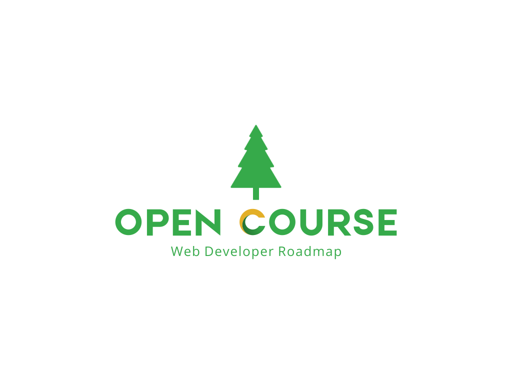

  

##

## 介绍
本项目是一个前端开发路线学习资源集合，主要是为了构建前端知识体系的一些笔记及学习心得，方便查阅。

## 状态
本项目处于开发阶段，目前只有一些零散的内容，后续会逐步完善。

## 首页
Visit [https://www.ultimate-kernel.fun/open-course](https://www.ultimate-kernel.fun/open-course)

## 学习小册
- [x] [《前端面试系列》](https://www.ultimate-kernel.fun/open-course/interview/)
- [x] [《Qiankun 微前端实践指南》](https://www.ultimate-kernel.fun/open-course/qiankun/)
- [x] [《Node.js 开发指南》](https://www.ultimate-kernel.fun/open-course/nodejs/)
- [ ] [《React.js 开发实践》](https://www.ultimate-kernel.fun/open-course/react/)
- [ ] [《数据结构与算法学习》](https://www.ultimate-kernel.fun/open-course/algorithm/)
- [ ] [《Linux 运维实践》](https://www.ultimate-kernel.fun/open-course/linux/)
- [ ] [《Solidity 开发实践》](https://www.ultimate-kernel.fun/open-course/solidity/)

## AI 学习资源
| 名称 | 类型 |描述 |
| :---: |  :-------: | :---: |
| [AI-For-Beginners](https://microsoft.github.io/AI-For-Beginners/) | 课程 | 微软出品的人工智能入门课程，包括从入门级别的基础知识，到符号人工智能，深度学习，计算机视觉，自然语言处理，和其他AI技术，以及AI伦理等高级主题。每个主题都包含相应的学习材料，课程文本，和实践实验室。|

## 贡献
> `Node.js version >=16`，`pnpm version >=8`

欢迎勘误和贡献，如果你想要贡献一些内容，可以通过以下方式：
1. Fork 本仓库
2. 启动项目 `pnpm i && pnpm dev` 
3. 在你的仓库中修改内容，然后提交到你的仓库
4. 提交 PR 到本仓库的 `main` 分支，commit message 需要包含`--docs`，例如：`add nodejs --docs`

## 支持
如果你觉得这个项目对你有帮助，欢迎star，谢谢你的支持！

<!-- 

  

 -->
